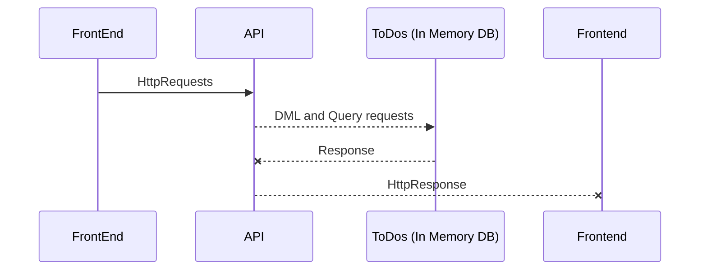

# NovaFori Development Test

This repo contains the implementarion of Developer Test by NovaFori.

Below are the details of applications created for the implementation:
### NovaForiServices
This is a web API created in .Net Core 3.0 with C# as programming language and an In-Memory data storage to store ToDo List. It contains the below endpoints:

 - */api/ToDo/ListItemsByStatus/{toDoStatus}* - This is a GET endpoint which returns ToDoList by status. The toDoStatus parameter can assume values as 1 or 2 corresponding to **Pending** and **Completed** ToDo items.
 - */api/ToDo/UpdateStatus/{id}* - This is a PUT endpoint which will just toggle the status of ToDo item with provided Id from Pending to Completed and vice versa.
 - */api/ToDo/AddItem* - This is a POST endpoint to add ToDo item to the list. The inserted item will always be in pending state with an Incremental Id.

The application **NovaForiServices.API.Test** contains the test coverage of above endpoints.

The application is currently configured to run on kestrel server with base URL http://localhost:5000 which may be updated by modifying the launch settings.

### Front End
The FrontEnd contains a Single Page application developed in Angular 13. It contains a single page with functionality to Add ToDo Item, Pending To Do Item Listing, Completed To Do Item Listing and Toggle To Do Item Status. 

It is configured to run on port 4200. The environment files *environment.ts* and *environment.prod.ts* contains the API_URL config key with value as http://localhost:5000

## Implementation Queries
This Section will list the answers to queries listed in Expected Output section of problem statement:

### How long did you spend on your solution?
5 and half hours approximately. However, productive time can be considered of around 3 hours. 

### How do you build and run your solution?
The applications are currently developed to test locally. Below are the steps to build and run the solution:

 - The backend application needs to be build in release mode in Visual Studio 2019. It then need to be run in kestrel server as per current configuration in order to have the API running on port 5000 with base url http://localhost:5000
 - The Frontend application resides in directory *\FrontEnd\to-do-management-app*. The required packes needs to be installed using `npm install` command.
 - Angular 10 needs to be installed in order to build and run fronend application.
 - Post installing the required packages as in above step, the application can be build and served on port 4200 using the command `ng serve --open`

### What technical and functional assumptions did you make when implementing your solution?

Since the current implementation is using In Memory database, the data will be iped out as soon as API application is restarted.

The application hadn't been configured for SSL for the sake of simplicity for test purpose, though it is not a recommended practice.

### Briefly explain your technical design and why do you think is the best approach to this problem.

This application just follow a basic design as shown below for the sake of simplicity:

API Endpoints are async so as to prevent blocking of UI Thread. It currently use In Memory database. The Exceptions are handled in UI Layer by logging them in console.

This is the better architecture for sake of simplicity. However, there is a scope of adding logging middleware,  implementing dependency injections and singleton and repository design pattern to improve the implementation.

## If you were unable to complete any user stories, outline why and how would you have liked to implement them.

Implemented all User Stories except for AC#2 for User Story 2, which states

*

> The user should be able to add this previous description to his or her
> to-do list

*
as was not clear on intended behaviour
